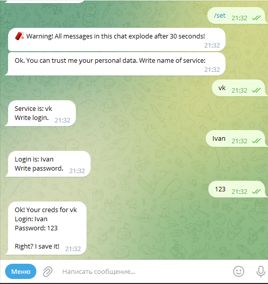
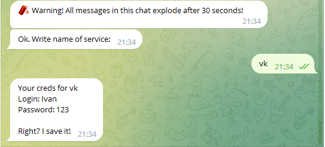
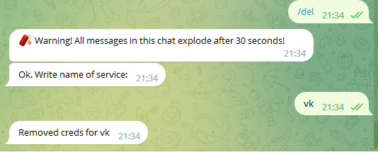

# VKContest
## Команды

1. "/set" - запускает диалог с пользователем, в ходе которого вводиться название сервиса, логин и пароль, затем эти данные сохраняются в базе данных.

   

2. "/get" - запускает диалог с пользователем, где вводится имя сервиса, от которого необходимо получить логин и пароль.

   

3. "/del" - запускает диалог с пользователем, где вводится имя сервиса, от которого необходимо удалить логин и пароль из базы данных.

   

4. Также все сообщения в чате удаляются спустя 30 секунд.

## Дополнительный возможности

1. Дополнительно можно реализовать установление секретного ключа пользователем для того, чтобы можно было защитить данные от несанкционированного доступа. Секретный ключ будет храниться в базе данные в захэшированном виде при помощи алгоритма pbkdf2.
2. Также можно реализовать шифрование паролей, так как хранить их в открытом виде небезопасно, при помощи алгоритма AES-256, а производить расшифровку данных после того, как произойдет подтверждение по секретному ключу.